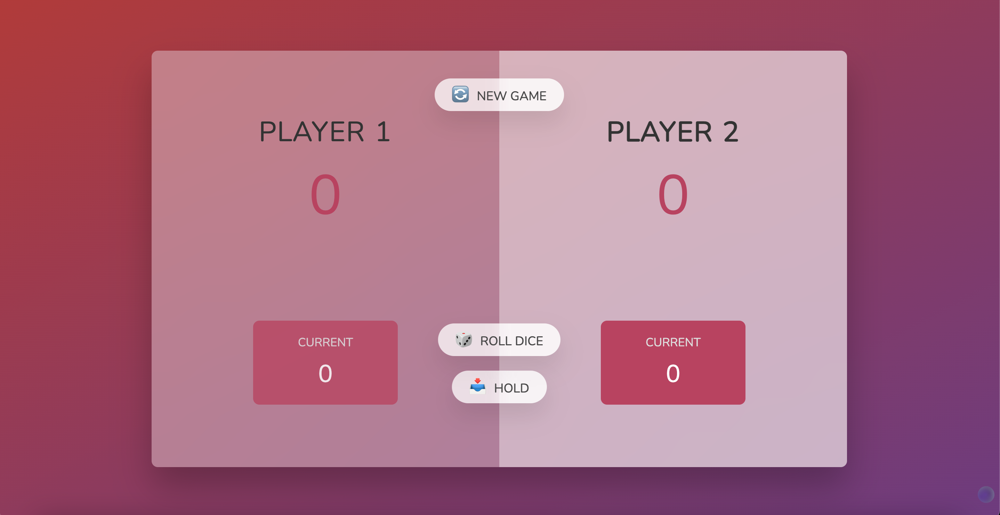

# Pig Game

# Game Rules

On a turn, a player rolls the die 🎲 repeatedly. The goal is to accumulate as many points as possible, adding up (hold) the numbers rolled on the die 🎲. However, if a player rolls a 1, the player's turn is over and any points they have accumulated during this turn are forfeited. Rolling a 1 doesn't wipe out your entire score from previous turns, just the total earned during that particular roll. A player has to choose to hold (stop rolling the die 🎲) if they do not want to take a chance of rolling a 1 and losing all of their points from this turn. If the player chooses to hold, all of the points rolled during that turn are added to his or her score. When a player reaches a total of 100 points, the game ends and that player is the winner.

# How to launch the game

1. Right click on the index.html file and copy the full path
2. Paste the path onto your web url and enter
3. Enjoy the game!
